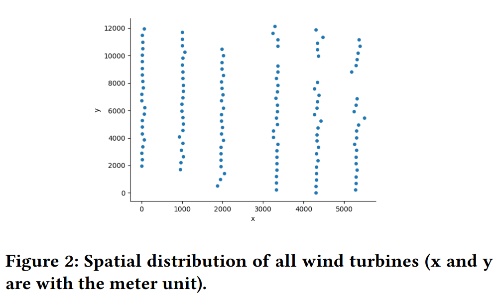

# 2022 인하 인공지능 챌린지 | Spatio-Temporal

> **대회 일정**
> 1. 대회 기간: 22. 6. 20. ~ 22. 7. 22.
> 2. 본 대회: 22. 7. 29. 14:00 ~ 18:00
>    1. Test 데이터셋 공개: 14:00
>    2. 리더보드 운영: 14:00 ~ 18:00
>    3. 소스코드 및 발표자료 제출: 18:00 까지
> 3. 순위발표: 22. 8. 5. 17:00
> 4. 발표 및 시상식: 22. 8. 11. 13:00 ~ 18:00


# 1. [데이터](https://dacon.io/competitions/official/235926/talkboard/406431?page=1&dtype=recent)
```
TurbID  - 발전기 ID
Day     - 날짜
Tmstamp - 시간
Wspd    - 풍속
Wdir    - 터빈이 바라보는 각도와 실제 바람 방향 각도 차이
Etmp    - 외부 온도
Itmp    - 터빈 내부 온도
Ndir    - 터빈이 바라보는 방향 각도
Pab     - 터빈 당 3개의 날이 있으며 각각의 각도가 다름
Prtv    - 무효전력 : 에너지원을 필요로 하지 않는 전력
Patv    - 유효전력 : 실제로 터빈을 돌리는 일을 하는 전력
```
## 1.1 `Prtv` vs `Patv`
[reactive vs active power](https://www.youtube.com/watch?v=rY-mcPmL8u0)

## 1.2  Turbine figure


## 1.3 Spatial distribution of all wind turbines

[Question about relative spatial coordinate system](https://github.com/PaddlePaddle/PaddleSpatial/discussions/179) \
→ XY축이 위도/경도를 나타내는 것이 아니라 임의의 변환을 사용해서 나타낸 결과임 \
→ 터빈의 **방향**과 **상대적인 위치**를 변화시키진 않았음

# 2. [평가](https://dacon.io/competitions/official/235926/overview/rules)
## 2.1 평가 산식 및 평가 규제

```
- 특정 시간에 측정되지 않은 경우, 해당 Patv에 대하여 Error = 0
- 특정 시간에 측정된 Feature의 값이 Patv ≤ 0 and Wspd > 2.5인 경우, Patv 에 대하여 Error = 0
- 특정 시간에 측정된 Feature의 값이 Pab1 > 89° or Pab2 > 89° or Pab3 > 89°인 경우, Patv에 대하여 Error = 0
- 특정 시간에 측정된 Feature의 값이 Ndir > 720° or Ndir < -720°인 경우 Patv에 대하여 Error = 0
- 특정 시간에 측정된 Feature의 값이 Wdir > 180° or Wdir < -180°인 경우, Patv에 대하여 Error = 0

(※ Error = 실제 값 - 예측 값)
```

# 3. Baseline
1. [TensorFlow baseline](https://dacon.io/competitions/official/235926/codeshare/5220?page=1&dtype=recent)
   - 134개 터빈, 5일 seq_len, 2일 target
2. [PyTorch baseline](https://dacon.io/competitions/official/235926/codeshare/5289?page=1&dtype=recent)
3. [태양광 발전량 예측 AI 경진대회](https://dacon.io/competitions/official/235680/codeshare/2366?page=1&dtype=recent)
   - 다양한 모델에 대한 linear blending ensemble

# 4. EDA
1. 전처리가 필요
   - `Wspd`: `log`
   - `Wdir`, `Ndir`: 이해할 수 있는 범위로 그룹화 (0~90), 수식 참조 필요
   - `Etmp`, `Itmp`: anomaly값들을 평균값으로 치환
   - `Pab`: 수식 참조 필요
   - `Patv`: 무슨 의미인지 조사 필요
2. Feature visualization 해보기
3. 5일 대신 좀 더 학습 데이터를 길거나 짧게 해보기
4. 시간에 따른 비중 차이를 두어야 함
5. Outlier 처리방법 고찰
6. 육풍, 해풍을 고려한 하루 내 시간 고려
7. `Prtv`: 실제 사용 전력
8. `Pab`와 `Patv`의 관계 탐색

# * REFERENCES 주최 측 추천 참고자료 *

[1] 2022. Penmanshiel (United-Kingdom) dataset. https://www.thewindpower.net
windfarm_en_23147_penmanshiel.php. Online; accessed 06 April 2022.\
[2] 2022. Wind Power Forecasting (Kaggle). https://www.kaggle.com/datasets/
theforcecoder/wind-power-forecasting. Online; accessed 06 April 2022.\
[3] Kyunghyun Cho, Bart van Merriënboer, Dzmitry Bahdanau, and Yoshua Bengio. 2014. On the Properties of Neural Machine Translation: Encoder–Decoder Approaches. In Proceedings of SSST-8, Eighth Workshop on Syntax, Semantics and
Structure in Statistical Translation. 103–111.\
[4] Xing Deng, Haijian Shao, Chunlong Hu, Dengbiao Jiang, and Yingtao Jiang. 2020.
Wind power forecasting methods based on deep learning: A survey. Computer
Modeling in Engineering and Sciences 122, 1 (2020), 273.\
[5] Aoife M Foley, Paul G Leahy, Antonino Marvuglia, and Eamon J McKeogh. 2012.
Current methods and advances in forecasting of wind power generation. Renewable energy 37, 1 (2012), 1–8.\
[6] Ying-Yi Hong and Christian Lian Paulo P Rioflorido. 2019. A hybrid deep learningbased neural network for 24-h ahead wind power forecasting. Applied Energy
250 (2019), 530–539.\
[7] Jun Hu and Wendong Zheng. 2020. Multistage attention network for multivariate
time series prediction. Neurocomputing 383 (2020), 122–137.\
[8] Qinghua Hu, Shiguang Zhang, Man Yu, and Zongxia Xie. 2015. Short-term wind
speed or power forecasting with heteroscedastic support vector regression. IEEE
Transactions on Sustainable Energy 7, 1 (2015), 241–249.\
[9] Zhao-Yu Jiang, Qing-Shan Jia, and XH Guan. 2019. A review of multi-temporaland-spatial-scale wind power forecasting method. Acta Automatica Sinica 45, 1
(2019), 51–71.\
[10] Ting Li, Junbo Zhang, Kainan Bao, Yuxuan Liang, Yexin Li, and Yu Zheng. 2020.
Autost: Efficient neural architecture search for spatio-temporal prediction. In
Proceedings of the 26th ACM SIGKDD International Conference on Knowledge
Discovery & Data Mining. 794–802.\
[11] Yuxuan Liang, Songyu Ke, Junbo Zhang, Xiuwen Yi, and Yu Zheng. 2018. Geoman:
Multi-level attention networks for geo-sensory time series prediction.. In IJCAI,
Vol. 2018. 3428–3434.\
[12] M Milligan, M Schwartz, and Yih-huei Wan. 2003. Statistical wind power forecasting models: Results for US wind farms. Technical Report. National Renewable
Energy Lab.(NREL), Golden, CO (United States).\
[13] George Sideratos and Nikos D Hatziargyriou. 2007. An advanced statistical
method for wind power forecasting. IEEE Transactions on power systems 22, 1
(2007), 258–265.\
[14] Huai-zhi Wang, Gang-qiang Li, Gui-bin Wang, Jian-chun Peng, Hui Jiang, and
Yi-tao Liu. 2017. Deep learning based ensemble approach for probabilistic wind
power forecasting. Applied energy 188 (2017), 56–70.\
[15] Xiaochen Wang, Peng Guo, and Xiaobin Huang. 2011. A review of wind power
forecasting models. Energy procedia 12 (2011), 770–778.\
[16] Haixu Wu, Jiehui Xu, Jianmin Wang, and Mingsheng Long. 2021. Autoformer: Decomposition transformers with auto-correlation for long-term series forecasting.
Advances in Neural Information Processing Systems 34 (2021).\
[17] Jianwu Zeng and Wei Qiao. 2011. Support vector machine-based short-term wind
power forecasting. In 2011 IEEE/PES Power Systems Conference and Exposition.
IEEE, 1–8.\
[18] Haoyi Zhou, Shanghang Zhang, Jieqi Peng, Shuai Zhang, Jianxin Li, Hui Xiong,
and Wancai Zhang. 2021. Informer: Beyond efficient transformer for long sequence time-series forecasting. In Proceedings of AAAI.\
[19] Jingbo Zhou and Anthony KH Tung. 2015. Smiler: A semi-lazy time series prediction system for sensors. In Proceedings of the 2015 ACM SIGMOD International
Conference on Management of Data. 1871–1886.\