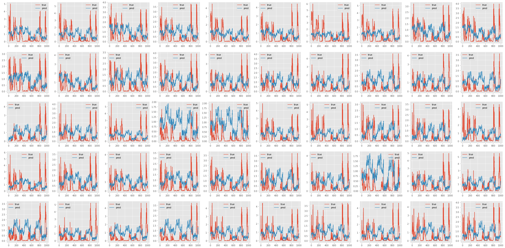

# 1. [baseline1.ipynb](proposed/baseline1.ipynb)
## Data
- Train data: 5일
- Test data: 2일
- Sliding window로 생성

## Training
- NN: GRU(256) - Dense(516) - Dense(288)
- Optimizer: RMSProp(lr=1e-3)
- Loss: MSE
- Epochs: 10
- Batch size: 128

```
 File Name : 
	baseline1.csv

Accuracy:  46.7085%

 	 RMSE: 26.80773266298162, MAE: 19.66573268982056

 --- Overall Score ---
	23.23673267640109
```


# 2. [proposed1.ipynb](proposed/proposed1.ipynb)
**baseline1** 에서 다음을 추가

## Data
- `StandardScaler` 적용

```
 File Name : 
	proposed1.csv

Accuracy:  47.1609%

 	 RMSE: 50.91567351662873, MAE: 46.670559504018996

 --- Overall Score --- 
	48.79311651032386
```

---

# 3. [proposed2.ipynb](proposed/proposed2.ipynb)
**baseline1** 에서 다음을 추가

## Training
- Validation set 추가
- Early stopping(patience=10) 추가
    - Overfitting이 심해 많이 학습하지 못한다 → Regularization 필요

```
 File Name : 
	proposed2.csv

Accuracy:  54.0560%

 	 RMSE: 24.517586741073245, MAE: 17.771835530432146

 --- Overall Score --- 
	21.144711135752694
```


# 4. [proposed3.ipynb](proposed/proposed3.ipynb)
**proposed2** 에서 다음을 추가

## Model
- `BatchNormalization`, `Dropout` 추가
  ```
  model = Sequential([
      GRU(256, input_shape=train_x[0].shape),
      BatchNormalization(),
      Dropout(0.4),
      
      Dense(516, activation='relu'),
      BatchNormalization(),
      Dropout(0.4),
  
      Dense(288, activation='relu')
  ])
  ```

```
 File Name : 
	proposed3.csv

Accuracy:  40.8675%

 	 RMSE: 26.95957636335696, MAE: 19.47166986231859

 --- Overall Score --- 
	23.215623112837775
```


# 5. [proposed4.ipynb](proposed/proposed4.ipynb)
**proposed2** 에서 다음을 추가

## Data
- `TurbID` 별로 model을 생성

```
 File Name : 
	proposed4.csv

Accuracy:  54.3031%

 	 RMSE: 34.0816873234851, MAE: 30.090377192844116

 --- Overall Score --- 
	32.08603225816461
```


# 6. [proposed6.ipynb](proposed/proposed6.ipynb)
**proposed5** 에서 다음을 추가

## Data
- `Wspd_cos`, `TSR1, 2, 3`, `Bspd1, 2, 3`, `rpm` 추가 
```
train_data['Wspd_cos'] = train_data['Wspd']*np.cos(train_data['Wdir']/180*np.pi)

alpha = 20
train_data['TSR1'] = 1/np.tan(np.radians(train_data['Pab1']+alpha))
train_data['TSR2'] = 1 / np.tan(np.radians(train_data['Pab2'] + alpha))
train_data['TSR3'] = 1 / np.tan(np.radians(train_data['Pab3'] + alpha))    

train_data['Bspd1'] = train_data['TSR1'] * train_data['Wspd_cos']
train_data['Bspd2'] = train_data['TSR2'] * train_data['Wspd_cos']
train_data['Bspd3'] = train_data['TSR3'] * train_data['Wspd_cos']

train_data['rpm'] = (train_data['Bspd1'] + train_data['Bspd2'] + train_data['Bspd3']) / 3
```

```
 File Name : 
	proposed6.csv

Accuracy:  55.3906%

 	 RMSE: 26.382792118773786, MAE: 20.4176044874672

 --- Overall Score --- 
	23.400198303120494
```


# 7. [proposed7.ipynb](proposed/proposed7.ipynb)
**proposed5** 에서 다음을 추가

## Data
- Validation set을 여러 개로 사용 (Training set과 겹치는 부분 있음)


- `Patv=0`인 부분을 잘 다듬어야 한다.

```
 File Name : 
	proposed7.csv

Accuracy:  52.8691%

 	 RMSE: 26.707425563416784, MAE: 20.76662316993727

 --- Overall Score --- 
	23.737024366677026
```


# 8. [proposed8.ipynb](proposed/proposed8.ipynb)
**proposed7** 에서 다음을 추가

## Data
- Feature engineering 추가 (proposed6 보다 개선)



```
 File Name : 
	proposed8.csv

Accuracy:  32.0247%

 	 RMSE: 34.68416953844638, MAE: 27.361807267416847

 --- Overall Score --- 
	31.022988402931617
```


# 9. [proposed9.ipynb](proposed/proposed9.ipynb)
**proposed8** 에서 다음을 추가

## Data
- `Patv`만 사용하여 예측


```
 File Name : 
	proposed9.csv

Accuracy:  49.4525%

 	 RMSE: 28.70997457789587, MAE: 22.651805544984676

 --- Overall Score --- 
	25.680890061440273
```


# 10. [proposed10.ipynb](proposed/proposed10.ipynb)
**proposed7** 에서 다음을 추가

## Model
`f: X_{1:t-s}, y_{1:t-s} → X_{t-s+1:t}, y_{t-s+1:t}`


```
 File Name : 
	proposed10.csv

Accuracy:  62.8850%

 	 RMSE: 47.01281746268941, MAE: 44.8693864877889

 --- Overall Score --- 
	45.94110197523916
```
# 10. [proposed11.ipynb](proposed/proposed11.ipynb)
[medium article](https://towardsdatascience.com/gru-recurrent-neural-networks-a-smart-way-to-predict-sequences-in-python-80864e4fe9f6)


Encoder - Decoder 모델 적용,
input , output
288*n_features , 288*n_features 로 변경
